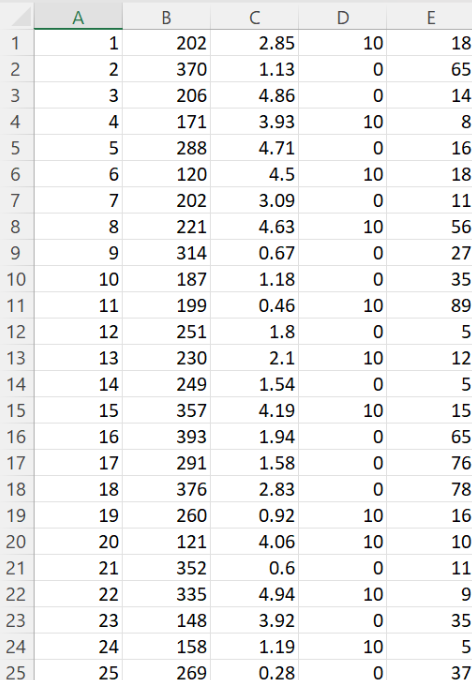
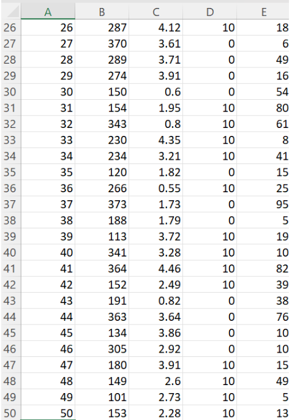

## 7.0 Appendix

The following is the full content of the sample_shipments.csv file used in the demonstration. This file is in Comma-Separated Values (CSV) format, where each line represents one shipment record and each value is separated by a comma. The fields are ordered as follows:

**Shipment ID, Revenue, Time Remaining, Service Level, Weight**

This data was used as input for the optimization program to calculate priority scores and select shipments accordingly. The full dataset contains multiple rows, each representing a unique shipment entry.
