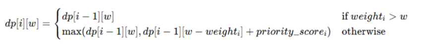

## **4.5 Algorithm Description**

### **4.5.1 Key Idea**

Construct a **Dynamic Programming (DP)** table `dp[i][w]` where:

- `i` represents the shipment index (from 1 to *n*),
- `w` represents the truck’s remaining weight capacity (from 0 to *W*).

Each entry `dp[i][w]` stores the **maximum achievable priority score** using the first *i* shipments and a weight limit of *w*.

---

### **4.5.2 Recurrence Relation**

The recurrence relation (logic used to fill the DP table) considers two possibilities for each shipment *i*:

---

### **4.5.3 Algorithm Steps**

#### **1. Preprocessing**

- Calculate priority scores for all shipments using the given formula.

#### **2. DP Table Construction**

- Initialize `dp[0][w] = 0` for all `w`.
- Fill the table using the recurrence relation.

#### **3. Backtracking**

- Starting from `dp[n][W]`, backtrack to identify which shipments were included in the optimal solution.

---
