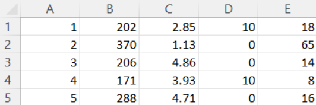

## 5.4 Demonstration 

This is a simple demonstration of the example under section 5.0 Algorithm Design. Only the shipments that have high enough priority scores to influence the optimization decision are selected, while others are omitted from the result for brevity.

The CSV file named sample_shipments.csv contains 5 fields:
- ShipmentID
- Revenue
- TimeRemaining
- ServiceLevel
- Weight

Below is a sample of the first 5 lines in the CSV:

For example, line 1 indicates:
- Shipment ID = 1
- Revenue = 202
- Time remaining = 2.85 hours
- Service level = 10
- Weight = 18 kg

The Java program reads this file, calculates priority scores, and runs the Knapsack algorithm. Only shipments contributing to the optimal score (while staying within the total 500 kg limit) are selected.

**Please refer to Appendix for full sample CSV content and structure.**
