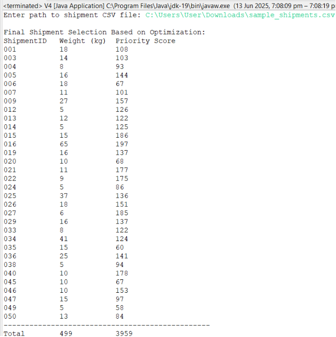

## 5.5 Results

This Java program optimizes DHL shipment selection using a 0/1 Knapsack approach, where each shipment is assigned a priority score based on its shipment id, revenue, time remaining, and service level. The program reads shipment data from a CSV file, calculates integer-rounded priority scores, and selects the best combination of shipments whose total weight does not exceed 500 kg while maximizing the total priority score. The final output displays selected shipments with their IDs, weights, and scores, followed by the total weight and total priority score (3959).
